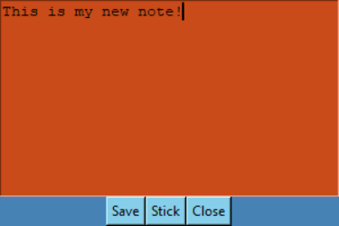

# Cadmus
Basically sticky notes with bizarre extras.

## Description
This is a Python program written using Tkinter, and allows to to open a new "note" with a colour of your choosing, write on it, and save it as a text document.  You can also stick it to the desktop, as well as unstick it, although this will not persist computer restarts.


## Dependencies
* Python 3.8 (has not been tested above or below this version).
* Windows 10 (has not been tested on macOS or Linux).

## Installing
* You can download the code from the Cadmus repository by clicking "Code", then "Download ZIP".

## Executing the Program
* You can either run cadmus.py through your IDE, or alternatively you can run it via the command line, e.g.:
```python cadmus.py```
* From the main screen, there are a number of buttons:
  * Create Note: This will create a new note using the colour you have generated, which will pop up as below:
 
  
  * Load Note: This will load up an .txt file, and put the text from it into a new note using the selected colour.
  * Choose Colour: This will take the RGB values you have selected (between 0-255 for each), and display the generated colour to you.  This is the colour that will be used when you create/load a note.
  * Random Colour: This will generate a random colour, and display it to you.  The colour you see is the colour that will be used when you create/load a note.
  * Moo?: This will play random mooing noise. They say that justt because you can, doesn't mean you should.  I have often pondered this.
* You can create multiple notes at once! Within each note you can:
    * Save: Save the note as a .txt file to your computer.
    * Stick: This removes the window border, making it look more like a note on your desktop screen.  You can click stick again to undo this.
    * Close: Closes the individual note.

## Authors
Marc Jowett (carkzis.apps@gmail.com)

## Version History
* 0.1
  * Initial Release.  See [commits](https://github.com/Carkzis/Cadmus/commits/main).

## License
This is licensed under the BSD-3-Clause License.  You can see the LICENSE.md for further details.
